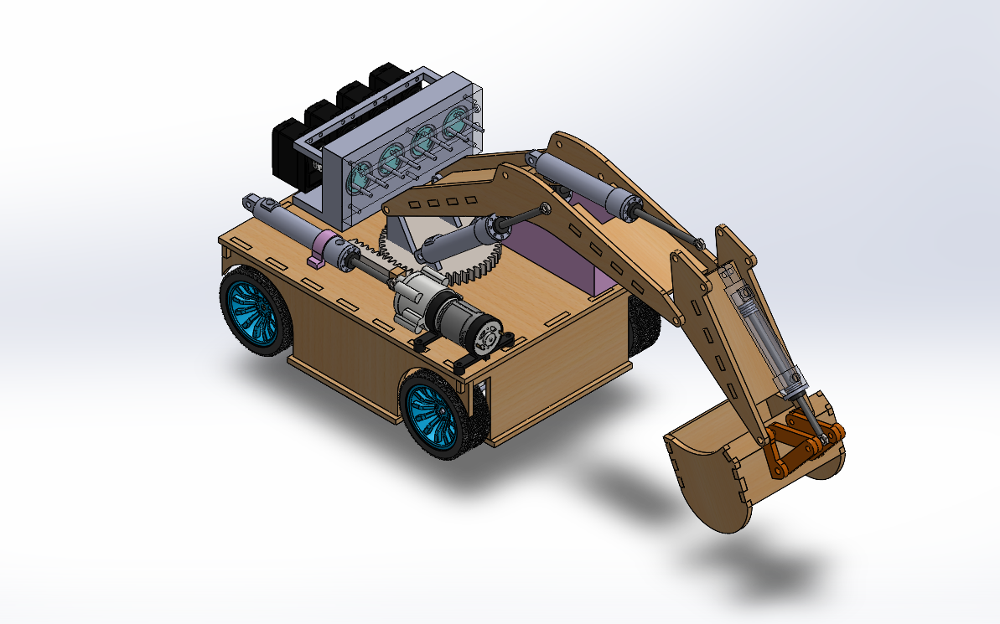

# Hydraulic Excavator 
### Control System

The excavator is controlled using a PS4 controller. Hydraulic fluid is pumped from the tank through a main line that branches into three separate lines. Each branch is connected to a valve and a hydraulic syringe responsible for one excavator arm link.

When a control button is pressed, the valve corresponding to the selected link opens while the other valves remain closed. This directs the hydraulic fluid to the required syringe, allowing independent movement of that link.

To move the link in the opposite direction, the fluid is pumped out of the syringe and returned to the tank. This control strategy enables independent hydraulic control of all three arm links.

